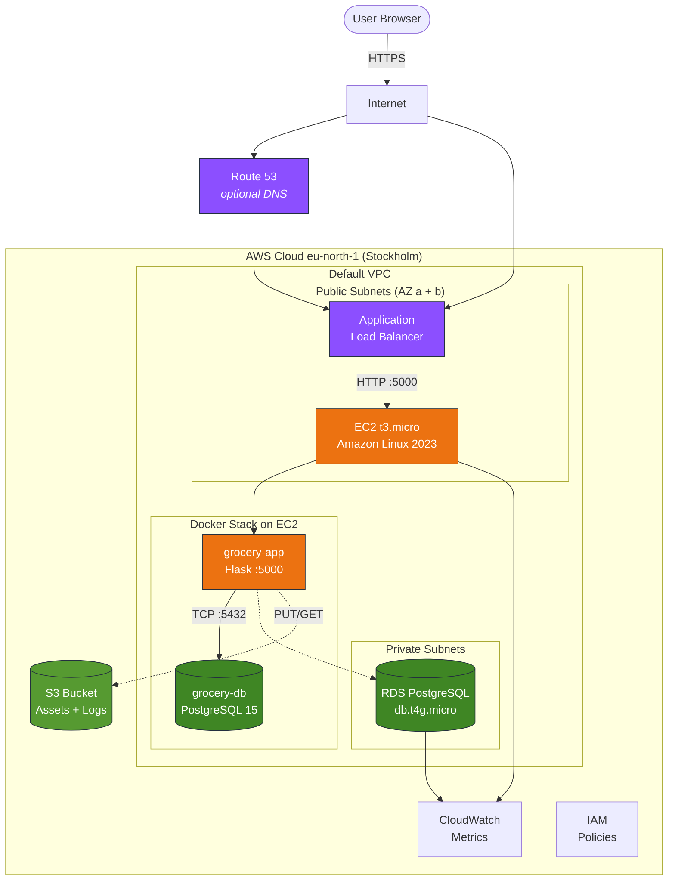

<div align="center">

#  GroceryMate on AWS

### Production-Grade E-Commerce Platform with Infrastructure-as-Code

*Flask  PostgreSQL  Docker  Terraform  EC2  ALB  RDS  S3*

---

[](https://aws.amazon.com)
[](https://www.terraform.io)
[](https://www.docker.com)
[](https://www.python.org)
[](https://www.postgresql.org)
[](https://flask.palletsprojects.com)
[](LICENSE)

**[ Live Demo](http://grocery-alb-1428278319.eu-north-1.elb.amazonaws.com)**  **[ Architecture](#-architecture)**  **[ Quick Start](#-quick-start)**  **[ Tech Stack](#-tech-stack)**

</div>

---

##  Table of Contents

- [About](#-about)
- [Architecture](#-architecture)
- [Tech Stack](#-tech-stack)
- [Quick Start](#-quick-start)
- [Deployment Paths](#-deployment-paths)
- [Infrastructure-as-Code](#-infrastructure-as-code)
- [Project Structure](#-project-structure)
- [Features](#-features)
- [Screenshots](#-screenshots)
- [Cost Breakdown](#-cost-breakdown)
- [Security Notes](#-security-notes)
- [Changelog](#-changelog)
- [License](#-license)
- [Credits](#-credits)

---

##  About

**GroceryMate** is a full-stack online grocery store built with Flask and React, fully containerised with Docker and deployable to AWS with a single Terraform command. This fork extends the original educational project with **production-grade cloud infrastructure**:

-  Multi-container setup (Flask app + PostgreSQL) via Docker Compose
-  Complete AWS deployment: EC2, Application Load Balancer, RDS, S3
-  Infrastructure-as-Code with Terraform (reproducible, declarative)
-  Least-privilege security groups, encrypted storage at rest
-  GitHub Actions workflow for `terraform validate` on every PR

> This project was built as part of the **Masterschool Data Engineering** track (Weeks 38). See [`CHANGELOG.md`](CHANGELOG.md) for week-by-week progress.

---

##  Architecture

<div align="center">


*Generated from [`docs/architecture.py`](docs/architecture.py) with real AWS Architecture Icons*

</div>

<details>
<summary> <b>Mermaid source (renders in-place on GitHub)</b></summary>



</details>

### Traffic Flow

1. **User** hits the **ALB DNS** (or a custom domain via Route 53).
2. **ALB** health-checks the target group on port 5000 and forwards traffic to the **EC2 instance**.
3. On EC2, **Docker Compose** runs the Flask app and a companion PostgreSQL container.
4. The app **could** talk to **RDS** instead of the in-cluster DB (IaC-ready  see [`infrastructure/rds.tf`](infrastructure/rds.tf)).
5. Static assets and snapshots can be offloaded to **S3**.

---

##  Tech Stack

| Layer | Technology | Why |
|-------|-----------|-----|
| **Frontend** | React  HTML5  CSS3 | Component-based UI with pre-built bundle |
| **Backend** | Python 3.11  Flask 3.0  SQLAlchemy | Lightweight, fast to iterate |
| **Database** | PostgreSQL 15 | ACID, relational, industry standard |
| **Auth** | Flask-JWT-Extended | Stateless JWT auth |
| **Containerisation** | Docker  Docker Compose | Reproducible environments |
| **IaC** | Terraform 1.14 + AWS Provider 5.x | Declarative cloud resources |
| **Cloud** | AWS EC2  ALB  RDS  S3  VPC | Managed, scalable |
| **Region** | `eu-north-1` (Stockholm) | Low cost, EU data residency |
| **CI** | GitHub Actions | `terraform validate` on every push |

---

##  Quick Start

### Run Locally (Docker required)

```bash
# 1. Clone
git clone --branch version2 https://github.com/sakhiaryan/AWS_grocery.git
cd AWS_grocery

# 2. Start the stack (app + database)
docker-compose up -d --build

# 3. Open the app
open http://localhost:5000        # macOS
xdg-open http://localhost:5000    # Linux
```

>  On macOS, port 5000 is occupied by AirPlay. Change the port mapping to `"5001:5000"` in [`docker-compose.yml`](docker-compose.yml) if you hit `address already in use`.

### Deploy to AWS (Terraform)

```bash
cd infrastructure
cp terraform.tfvars.example terraform.tfvars   # then edit db_password
terraform init
terraform apply     # spins up EC2 + SGs + RDS
```

Terraform outputs the public URL automatically:

```hcl
app_url      = "http://13.60.104.49:5000"
rds_endpoint = "grocerymate-rds.abcdef.eu-north-1.rds.amazonaws.com:5432"
```

---

##  Deployment Paths

Three ways to run GroceryMate  pick the one that fits the use case:

| Path | Command | Cost | Best For |
|------|---------|------|---------|
|  **Local Docker** | `docker-compose up` | Free | Development |
|  **EC2 + Docker Compose** | SSH & `docker-compose up` on EC2 | ~Free Tier | Staging |
|  **Terraform + RDS + ALB** | `terraform apply` | ~$18/month | Production-like |

---

##  Infrastructure-as-Code

The [`infrastructure/`](infrastructure/) folder contains the entire AWS setup in **modular declarative Terraform**  7 focused modules wired together by the root configuration:

```
infrastructure/
 main.tf                   # Root: providers + all module wiring
 variables.tf              # 16 configurable inputs
 outputs.tf                # ALB DNS, RDS endpoint, S3 bucket, Lambda 
 terraform.tfvars.example
 .gitignore
 modules/
     vpc/        # Custom VPC + 2 public & 2 private subnets + IGW
     security/   # 3 SGs (ALB  EC2  RDS), least privilege chain
     iam/        # EC2 instance profile (SSM + S3 read), Lambda role
     compute/    # ALB + Target Group + Launch Template + Auto Scaling Group
     rds/        # PostgreSQL 17 in private subnets, encrypted, backups
     s3/         # Encrypted bucket, public access blocked
     lambda/     # Health-check Lambda + EventBridge cron (5-min)
```

**Why Terraform?**
-  One command (`terraform apply`) spins up the whole stack.
-  One command (`terraform destroy`) tears it all down  no forgotten resources.
-  Version-controlled infrastructure  every change is a reviewable PR.
-  State file lets you import existing resources without rebuilding.

---

##  Project Structure

```
AWS_grocery/
 backend/                     # Flask API + React build
    app/                     # Application modules
    Dockerfile               # Container image definition
    requirements.txt         # Python deps
    run.py                   # Entry point (0.0.0.0:5000)
 frontend/                    # React source (pre-built)
 infrastructure/              # Terraform IaC (see above)
 docs/
    screenshots/             # UI screenshots for README
 .github/
    workflows/
        terraform-validate.yml
 docker-compose.yml           # Local + EC2 stack definition
 CHANGELOG.md                 # Week-by-week progress
 CONTRIBUTING.md              # How to submit changes
 LICENSE                      # MIT
 README.md                    # You are here 
```

---

##  Features

-  **JWT-based authentication**  secure login, registration, session handling
-  **Product search + filter**  by category, price, or full-text
-  **Favorites**  save products for later
-  **Shopping basket**  add, modify, remove, persist across sessions
-  **Checkout**  multiple payment methods, automatic totals
-  **12-factor ready**  config via env vars, stateless app container
-  **Observability-friendly**  structured app logs, ALB health checks
-  **Encrypted at rest**  EBS and RDS storage encryption enabled
-  **Infrastructure reproducible in < 10 minutes** via Terraform

---

##  Screenshots

<div align="center">


*MarketMate brand logo  the app served via the AWS Application Load Balancer*

</div>

---

##  Cost Breakdown

| Service | Instance | Free Tier? | Monthly Estimate |
|---------|---------|-----------|-----------------|
| EC2 | t3.micro |  750 h/month | $0 |
| EBS | 8 GB gp3 |  30 GB | $0 |
| RDS | db.t4g.micro |  750 h/month | $0 |
| ALB |  |  | ~$18 |
| S3 | Standard |  5 GB | $0 |
| Data Transfer | < 100 GB |  | $0 |
| **Total** | | | **~$18/month** |

>  Running `terraform destroy` after coursework keeps the bill at $0  nothing is left spinning.

---

##  Security Notes

- Master DB password lives **only** in `terraform.tfvars` (gitignored)  never committed.
- RDS security group accepts traffic **only from the EC2 security group**  no public DB endpoint.
- SSH is open to `0.0.0.0/0` for coursework convenience. **In production**, restrict the `allowed_ssh_cidr` variable to your own IP.
- EBS and RDS use **encryption at rest** with AWS-managed keys by default.
- The GitHub Actions workflow runs `terraform validate` on every push to catch broken HCL before merge.

---

##  Changelog

See [`CHANGELOG.md`](CHANGELOG.md) for a week-by-week breakdown of the Masterschool coursework that shaped this repo.

---

##  License

This project is licensed under the [MIT License](LICENSE). You are free to use, modify, and distribute it with attribution.

---

##  Credits

- **Original project**: [Alejandro Roman Ibanez](https://github.com/AlejandroRomanIbanez/AWS_grocery)  base Flask + React GroceryMate app.
- **AWS deployment + IaC**: [Aryan Sakhi-Alhosseini](https://github.com/sakhiaryan)  Docker containerisation, Terraform IaC, ALB/RDS/S3 integration, CI workflow.
- **Curriculum**: [Masterschool](https://www.masterschool.com) Data Engineering track (Cohort Student03.26).

<div align="center">

---

**Built with  in Berlin  Deployed to Stockholm **

</div>
